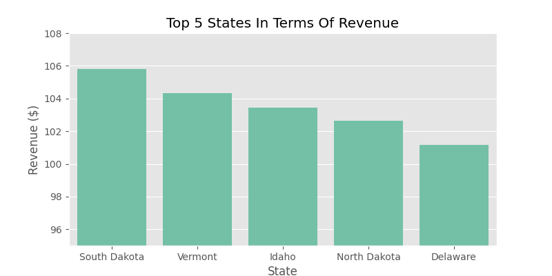
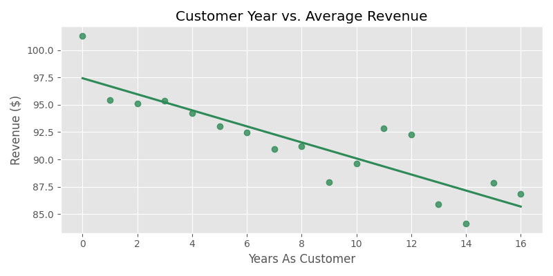

## Introduction
To optimize our sales strategy for this new product line, three different sales method is tested: email, phone calls, and a combination of both. For each method, the effort required from the sales team is different. The goal of this analysis is to assess the effectiveness of each method and provide valuable insights for future sales strategies.

This report contains the data validation and cleaning procedures, summarize the results of the exploratory data analysis, define a key performance metric for the business to track, and offer recommendations based on the findings.

---

## Data Validation
The dataset contains 15000 rows and 8 columns before cleaning and validataion. I have validated all the columns against the criteria in the dataset table:

- **week**: 6 unique values. No cleaning is needed
- **sales_method**: I detected irregular values with the unique method. I validated the column using replace.
- **customer_id**: Lowered the letters in case there was a uppercase letter, also replaced ' ' with '-'.
- **nb_sold**: No irregular or missing values. No cleaning is needed.
- **revenue**: Calculated ratio of the missing values. Checked if correlation existed with other variables. Ratio was around 7 percent. Filled the missing values with mean.
- **years_as_customer**: After using describe method, I found outliers, so I dropped the extreme values.
- **nb_site_visits**: No unique or missing values. No cleaning is needed.
- **state**: No unique or missing values. No cleaning is needed.

**After the data validation, the dataset contains 14467 rows and 8 columns without missing values.**

---
## Exploratory Analysis

### Revenue Distribution

.png>)

**Observations:**
- This histogram shows that area where the majority of our data is around 100, and the average revenue we got is 94.11.
- We can use this average number both to see our current situation and to compare ourselves both current and historical.

### Sales Method Count

.png>)

**Observations:**
- The pie chart indicates that "Email" is the most frequently used sales method.
- "Email + Call" is the least used method. 

### Revenue vs. Week by Sales Method

.png>)

**Observations:**
- This lineplot indicates a upward trend.
- Especially after 3 weeks, we need to ensure that we are using correct method.
- Eventhough "Email + Call" method is least used, it is the most profitable method.

### Average Revenue by Sales Method

.png>)

**Observations:**
- This barplot shows that the sales method that generates the most revenue is Email + Call.
- The Email + Call sales method, which provides approximately 80% more revenue than second best sales method, is 3-4 times ahead of the call method that generates the least revenue.
- Since Email + Call method requires lot more time than the other methods, we need to use Email + Call method to customers who is more likely to generate higher revenue.

### States With Higher Average Revenue

**Observations:**
- The top 5 states that generate the most revenue are as seen in the chart above.
- According to the workload of our salespersons, we can use Email + Call method to these 5 states.

### Customer Year and Average Revenue

**Observations:**
- New customers tend to generate more revenue than the long term customers.
- According to the workload of our salespersons, we can use Email + Call method to our new customers.

## Business Metrics

To monitor the effectiveness of our sales strategies, I have defined the following metrics:

### Metric: Average Revenue per Customer
This metric measures the revenue generated per customer. It allows us to compare our general performance both current and historical.

The visualization below shows the average revenue per customer:

.png>)

### Estimation of Initial Values

- The initial average revenue per customer is calculated by taking the average revenue per customer.

### Metric: Average Revenue per Customer For Each Sales Method

This metric measures the revenue generated per customer for each sales method. It allows us to compare the effectiveness of each method in generating revenue.

### Current Evaluation:

Based on the existing data, the Average Revenue per Customer for each sales method is as follows:

- Email: $97.21
- Call: $47.67
- Email and Call: $183.89

### Recommendations:

Based on the current evaluation, the "Email and Call" method generates the highest average revenue per customer. However, this method also requires the most time and effort from the sales team. Therefore, I recommend the following:

1. Continue using the "Email and Call" method for high-value customers (who live in top 5 states which stated above and/or new customers) who have a higher potential for revenue generation.
2. Use the "Email" method for lower-value customers to maintain engagement with minimal effort.
3. Give up using "Call" method since it is neither efficient nor profitable.
4. **Monitor the Average Revenue per Customer** metric by 6 months to track our general performance.
5. **Monitor the Average Revenue per Customer by Sales Method** on a monthly basis to track the performance of each sales method and make adjustments as needed.
6. When entering the methods, we must make sure that they are written correctly. It is also important to fill in the missing values in the revenue column as much as possible.

