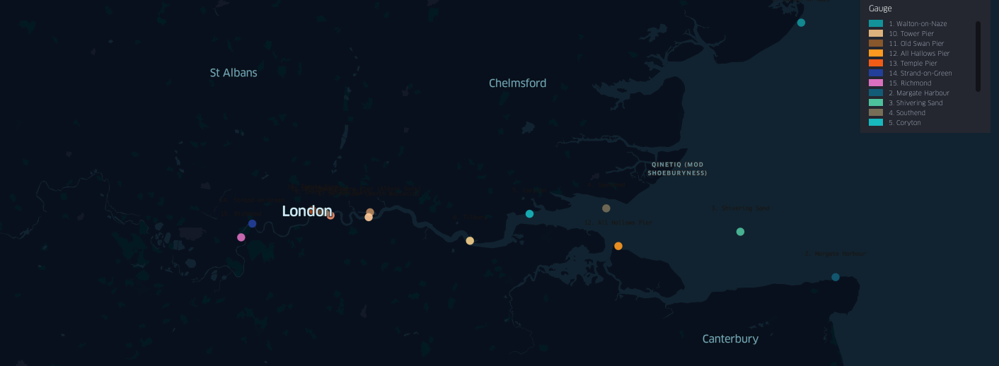

# Analyzing River Thames Water Levels

### Instructions 

- Analyze Thames River tidal data to track changes in high-tide and low-tide frequency over time.

- Load, manipulate, and prepare the data to create new structures and names that might benefit your analysis.

- Find the mean, median, and interquartile range for high- and low-tide data and save them as two separate pandas Series.

- Calculate the annual percentage of days with very high tide levels (90th percentile of high tide days) for each year and store the results as floats in a two-column DataFrame with the index reset.

- Calculate the same percentage for low-tide days (below the 10th percentile) and store the results in the same way.

- Create a dictionary named solution with a summary of your data analysis.

The TXT file contains data for three variables, described in the table below. 

| Variable Name | Description | Format |
| ------------- | ----------- | ------ |
| Date and time | Date and time of measurement to GMT. Note the tide gauge is accurate to one minute. | dd/mm/yyyy hh:mm:ss |
| Water level | High or low water level measured by tide meter.| 
| Flag | High water flag = 1, low water flag = 0 | Categorical (0 or 1) |

