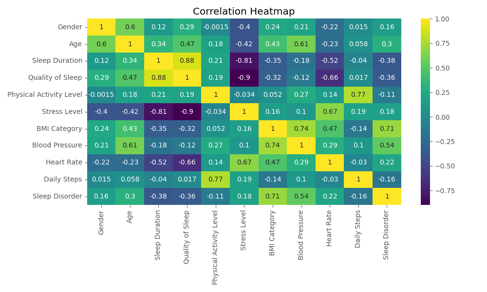
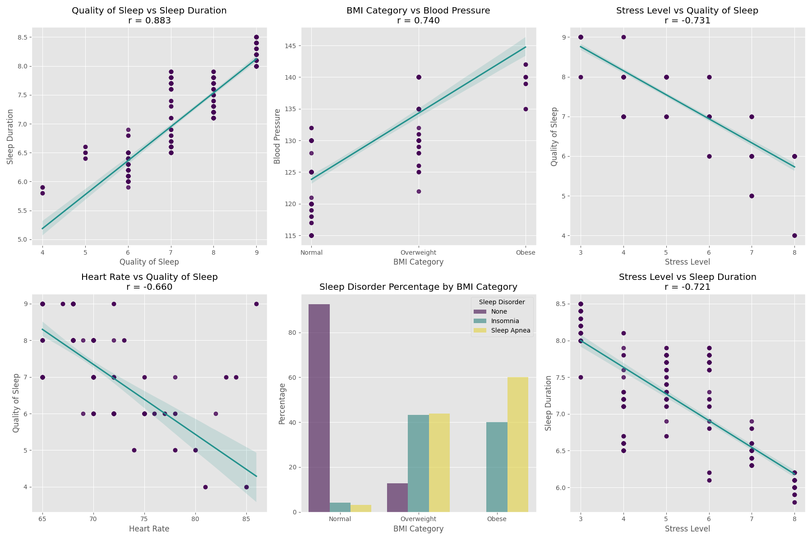
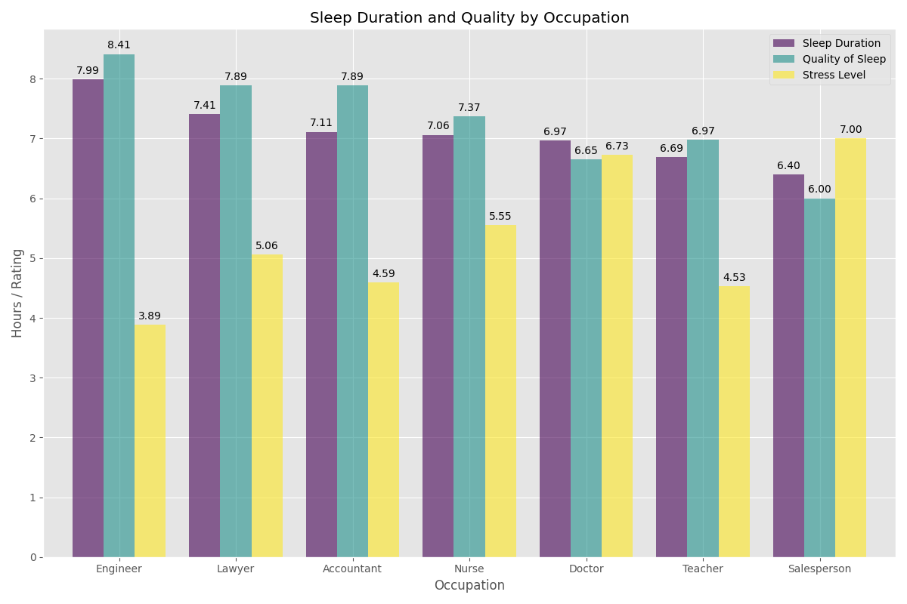
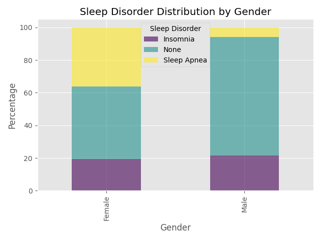
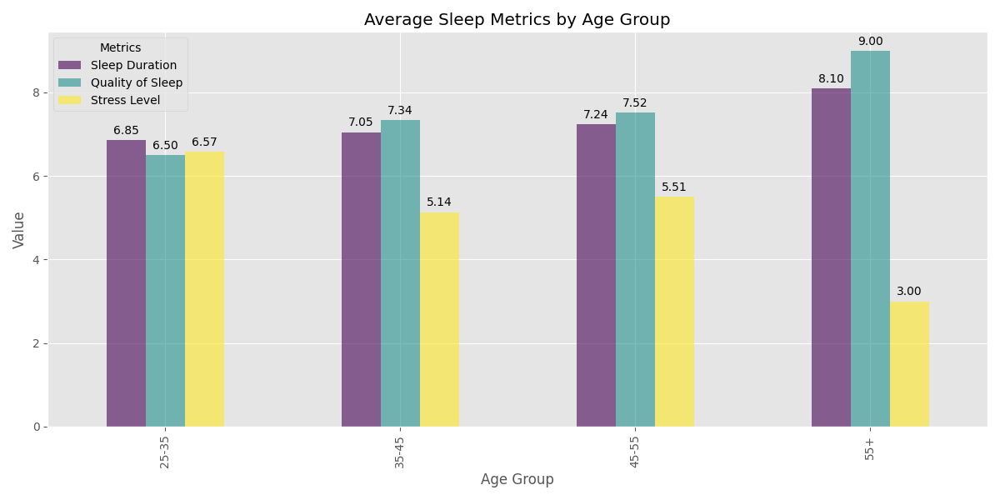
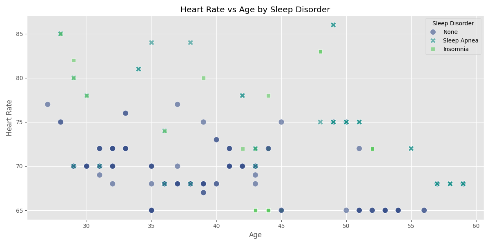

# Sleep Quality Analysis Report
## Introduction
This report analyzes a comprehensive sleep quality dataset containing various health and lifestyle metrics for individuals across different demographics. The dataset includes key variables such as:

- Sleep Duration and Quality
- Stress Levels
- Physical Activity Metrics (Daily Steps, Activity Level)
- Health Indicators (BMI, Blood Pressure)
- Demographic Information (Age, Gender, Occupation)
- Sleep Disorders (Insomnia, Sleep Apnea)

The analysis aims to uncover patterns and relationships between these variables to better understand factors affecting sleep quality and overall well-being. Through statistical analysis and visualization, I explore how lifestyle choices, occupational factors, and health metrics interact with sleep patterns.

My findings provide valuable insights for healthcare professionals, employers, and individuals looking to improve sleep quality and manage sleep-related health issues. The following sections detail my methodology and key discoveries from this rich dataset.

## Data Cleaning and Preprocessing
Before diving into the analysis, we performed several data cleaning steps:
- Handled missing values in the Sleep Disorder column by filling them with 'None'
- Standardized categorical variables like BMI Category and Gender
- Created age groups for better demographic analysis
- Converted blood pressure readings to numeric format
- Validated data ranges and removed outliers where necessary

## Key Insights from the Analysis

### Correlation Analysis

The correlation heatmap above reveals several interesting relationships in our sleep quality dataset:
- Strong positive correlation (0.883) between Sleep Quality and Sleep Duration
- Moderate negative correlation (-0.731) between Stress Level and Quality of Sleep
- Notable correlation between Physical Activity Level and Daily Steps (0.773)
- BMI Category shows meaningful correlation with Blood Pressure (0.740)

These correlations suggest that better sleep quality is associated with longer sleep duration, while higher stress levels tend to negatively impact both sleep quality and duration. Physical activity shows a clear relationship with daily step count, indicating consistent measurement of activity levels.

The subsequent visualizations explore these relationships in detail, examining how various factors like BMI, stress levels, and physical activity interact with sleep patterns and overall health metrics.

### Stress Level and Sleep Patterns ###

The scatter plots above demonstrate the significant negative relationships between stress levels and sleep metrics:

- Physical activity level demonstrates a strong positive correlation with daily steps (r = 0.773)
- Higher heart rate shows negative correlation with sleep quality (r = -0.660)
- Higher stress levels are strongly associated with reduced sleep quality (r = -0.731)
- Similarly, increased stress correlates with shorter sleep duration (r = -0.721)

This suggests that stress management could be crucial for improving sleep outcomes. 
 
### Occupational Impact on Sleep ###

Analysis by occupation reveals interesting patterns:
The analysis of sleep patterns across different occupations reveals several key findings:

- Healthcare professionals shows average sleep metrics even though they have high stress levels
- Sales representatives shows higher stress levels and their other sleep metrics are lower than average
- Engineers report higher than average sleep quality and lower stress levels, likely due to regular work schedules and structured environments

These variations likely reflect the different work schedules, stress levels, and physical demands associated with each profession. The data suggests that occupations with regular schedules tend to show better sleep metrics compared to those with irregular or shift-based schedules.

### Gender and Sleep Disorders ###

The distribution of sleep disorders shows notable gender differences:
- Sleep Apnea appears more prevalent in males
- Insomnia rates are relatively balanced between genders
- Female participants shows higher sleep disorder rates
 
### Age-Related Sleep Patterns ###

Sleep metrics across age groups reveal:
- Sleep quality tends to increase with age probably due to lower stress levels
- Older adults generally report better sleep metrics
 
### Heart Rate and Sleep Disorders ###

The relationship between heart rate, age, and sleep disorders indicates:

- Sleep Apnea patients consistently show higher heart rates (75-85 BPM) compared to those without sleep disorders
- Heart rates tend to decrease slightly with age across all groups
- Insomnia patients show more variable heart rates compared to other groups
- Those without sleep disorders maintain the lowest and most stable heart rates (65-75 BPM)

This suggests that elevated heart rate may be an important physiological marker for sleep disorders, particularly Sleep Apnea. The age-related decline in heart rate appears to be a consistent trend regardless of sleep disorder status.

### Conclusion ###
This comprehensive analysis of sleep patterns and health metrics has provided valuable insights into the complex relationships between sleep, stress, occupation, and demographic factors. The study revealed strong correlations between stress levels and sleep quality, with higher stress consistently associated with poorer sleep outcomes (r > -0.7). 

Occupational analysis highlighted how different work environments impact sleep patterns, with structured work schedules (like those of engineers) generally leading to better sleep metrics compared to more demanding or irregular schedules (such as healthcare professionals and sales representatives).

Demographic patterns emerged showing gender differences in sleep disorders, with males more prone to Sleep Apnea while females showed higher overall sleep disorder rates. Age-related trends indicated improved sleep quality in older adults, possibly due to lower stress levels. The study also identified clear physiological markers, with Sleep Apnea patients showing distinctly higher heart rates (75-85 BPM) compared to those without sleep disorders.

These findings emphasize the interconnected nature of sleep health, suggesting that effective sleep improvement strategies should consider multiple factors including stress management, work-life balance, and individual demographic characteristics. The results could be valuable for healthcare providers and organizations in developing targeted interventions for better sleep health outcomes.